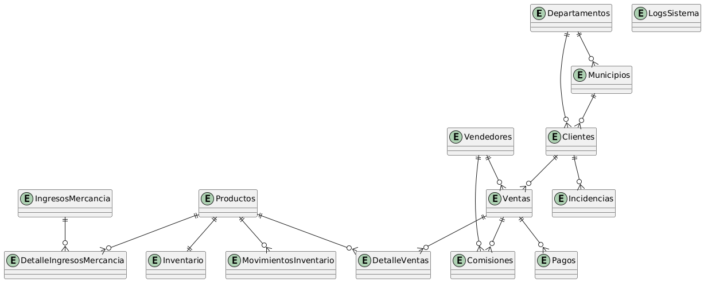
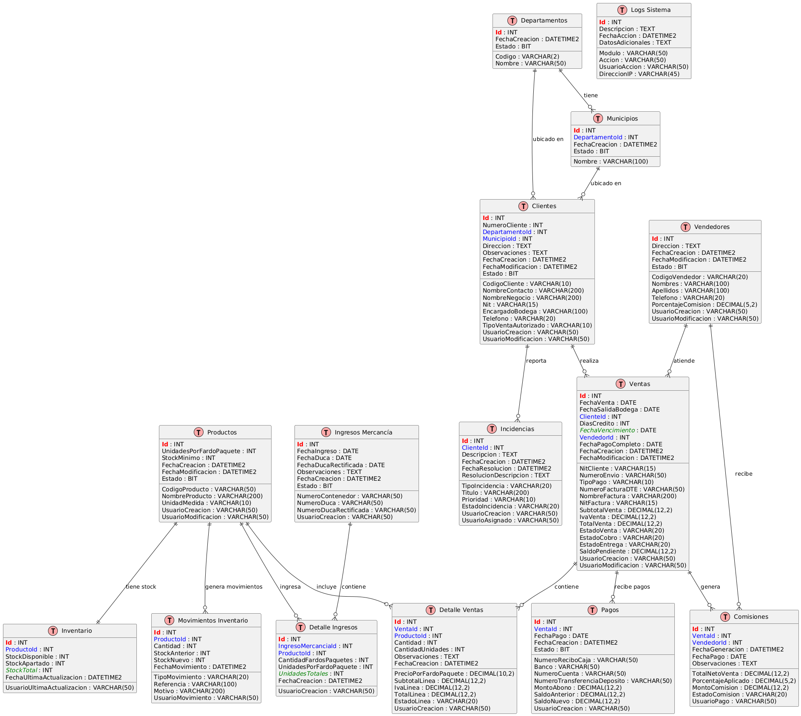
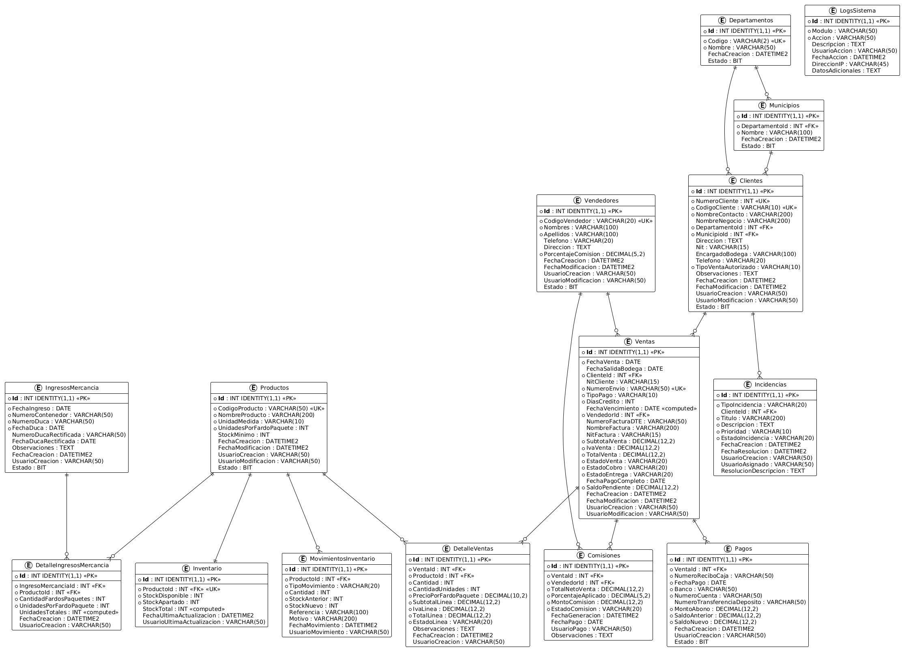

[← Regresar al README](../../../README.md)  
# Modelos Entidad Relación

## Modelo Logico
El Modelo Conceptual representa la visión de alto nivel de la base de datos desde la perspectiva del negocio. Este diagrama muestra las entidades principales del sistema y sus relaciones sin entrar en detalles técnicos. Sirve como una representación abstracta que captura los conceptos fundamentales del dominio del problema, permitiendo a los stakeholders entender la estructura general de los datos sin necesidad de conocimientos técnicos de bases de datos.  

## Modelo Conceptual
El Modelo Lógico es una representación más detallada que el modelo conceptual, donde se definen las entidades con sus atributos específicos y las relaciones entre ellas. En este diagrama se establecen las claves primarias y foráneas, así como los tipos de relaciones (uno a uno, uno a muchos, muchos a muchos). Este modelo sirve como puente entre la visión conceptual del negocio y la implementación técnica, siendo independiente del sistema gestor de base de datos que se utilizará.

## Modelo Físico 
El Modelo Físico es la representación más detallada y técnica, orientada a la implementación real en un sistema gestor de base de datos específico. Este diagrama incluye todos los detalles de implementación como tipos de datos exactos, restricciones, índices, procedimientos almacenados y otros elementos propios del sistema de gestión de base de datos seleccionado. Representa la estructura final que tendrá la base de datos cuando sea implementada en el sistema.

  

[← Regresar al README](../../../README.md)