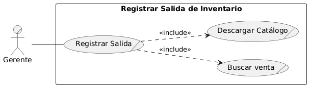
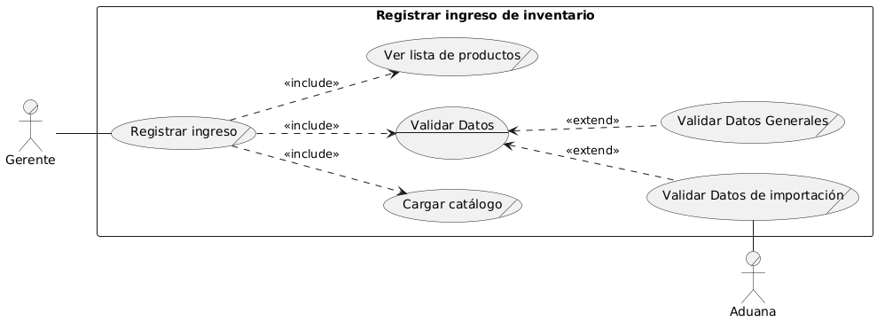
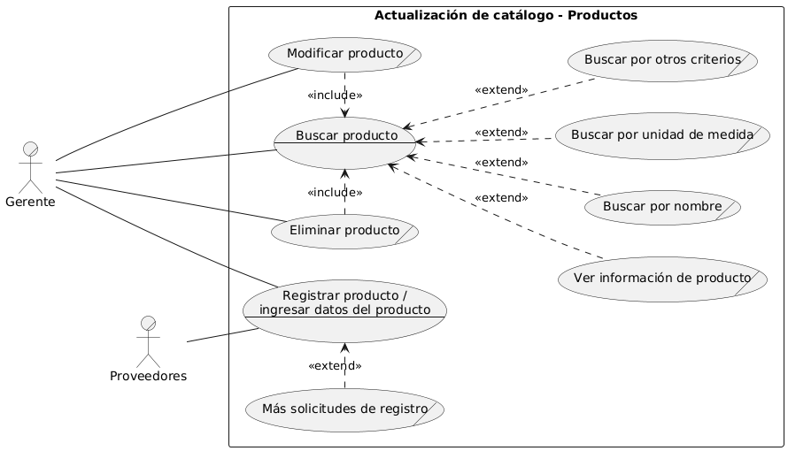
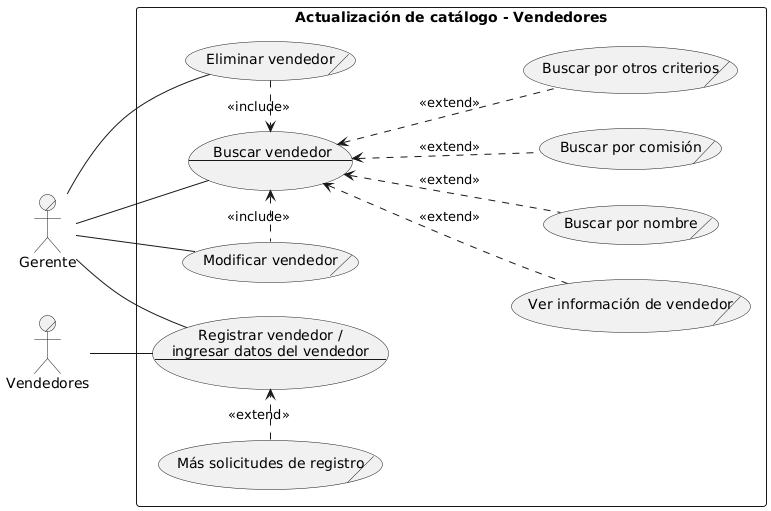
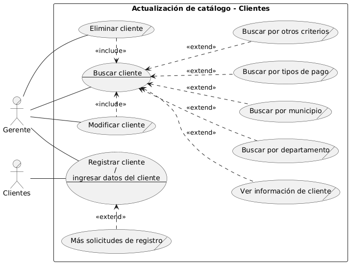
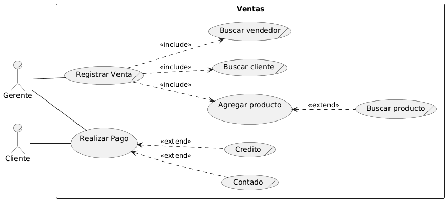
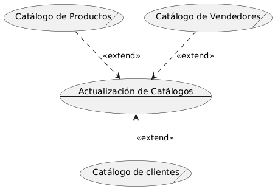
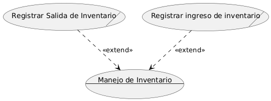

[← Regresar al README](../../../README.md)

# CASOS DE USO EXPANDIDOS 

## **MÓDULO: MANEJO DE INVENTARIO**

### CU001 – Registrar Salida de Inventario

| Campo                         | Detalle                                                                                                                                                                                 |
| ----------------------------- | --------------------------------------------------------------------------------------------------------------------------------------------------------------------------------------- |
| **ID**                        | CU001                                                                                                                                                                                   |
| **Módulo al que pertenece**   | Manejo de Inventario                                                                                                                                                                    |
| **Actor principal**           | Gerente                                                                                                                                                                                 |
| **Actores secundarios**       | Sistema de Ventas                                                                                                                                                                       |
| **Precondiciones**            | - Venta debe estar registrada - Usuario autenticado con permisos de gerente                                                                                                          |
| **Postcondiciones**           | - Stock actualizado - Registro de salida asociado a la venta                                                                                                                         |
| **Escenario principal**       | 1. Gerente busca la venta por número de envío o cliente 2. Visualiza productos asociados 3. Ingresa fecha de salida 4. Sistema descarga catálogo 5. Se actualiza inventario |
| **Escenario alternativo**     | - Venta no encontrada - Stock insuficiente                                                                                                                                           |
| **Requerimientos especiales** | - Trazabilidad de movimientos - Validación de productos contra inventario - Descarga del catálogo al momento del registro                                                         |

---

## **MÓDULO: MANEJO DE INVENTARIO**

### CU002 – Registrar Ingreso de Inventario

| Campo                         | Detalle                                                                                                                                                                |
| ----------------------------- | ---------------------------------------------------------------------------------------------------------------------------------------------------------------------- |
| **ID**                        | CU002                                                                                                                                                                  |
| **Módulo al que pertenece**   | Manejo de Inventario                                                                                                                                                   |
| **Actor principal**           | Gerente                                                                                                                                                                |
| **Actores secundarios**       | Aduana                                                                                                                                                                 |
| **Precondiciones**            | - Usuario autenticado - Productos importados con DUCA                                                                                                               |
| **Postcondiciones**           | - Inventario actualizado - Información legal (DUCA) registrada                                                                                                      |
| **Escenario principal**       | 1. Gerente inicia ingreso 2. Carga catálogo de productos 3. Visualiza lista de productos 4. Valida datos generales y de importación 5. Registra el ingreso |
| **Escenario alternativo**     | - DUCA incompleta o inválida - Datos no coinciden con catálogo                                                                                                      |
| **Requerimientos especiales** | - Validación con criterios de aduana - Asociación entre productos y DUCA - Cálculo automático de unidades                                                        |

---

## **MÓDULO: CATÁLOGO DE PRODUCTOS**

### CU003 – Gestión de Productos

| Campo                         | Detalle                                                                                                                              |
| ----------------------------- | ------------------------------------------------------------------------------------------------------------------------------------ |
| **ID**                        | CU003                                                                                                                                |
| **Módulo al que pertenece**   | Catálogo de Productos                                                                                                                |
| **Actor principal**           | Gerente                                                                                                                              |
| **Actores secundarios**       | Proveedores                                                                                                                          |
| **Precondiciones**            | - Usuario autenticado                                                                                                                |
| **Postcondiciones**           | - Producto creado, modificado o eliminado                                                                                            |
| **Escenario principal**       | 1. Buscar producto 2. Registrar nuevo producto (con datos completos) 3. Modificar o eliminar si aplica                         |
| **Escenario alternativo**     | - Producto ya existe (duplicado) - Error en unidad de medida                                                                      |
| **Requerimientos especiales** | - Validación del código del producto - Relación con unidad de medida - Permitir búsquedas por nombre, unidad u otros criterios |

---

## **MÓDULO: CATÁLOGO DE VENDEDORES**

### CU004 – Gestión de Vendedores

| Campo                         | Detalle                                                                                                                 |
| ----------------------------- | ----------------------------------------------------------------------------------------------------------------------- |
| **ID**                        | CU004                                                                                                                   |
| **Módulo al que pertenece**   | Catálogo de Vendedores                                                                                                  |
| **Actor principal**           | Gerente                                                                                                                 |
| **Actores secundarios**       | Vendedores                                                                                                              |
| **Precondiciones**            | - Usuario autenticado                                                                                                   |
| **Postcondiciones**           | - Vendedor registrado, modificado o eliminado                                                                           |
| **Escenario principal**       | 1. Buscar vendedor 2. Registrar nuevo vendedor (nombre, dirección, comisión) 3. Editar o eliminar si es necesario |
| **Escenario alternativo**     | - Comisión inválida - Código de vendedor ya existente                                                                |
| **Requerimientos especiales** | - Validación del porcentaje de comisión - Búsquedas por nombre, comisión u otros criterios                           |

---

## **MÓDULO: CATÁLOGO DE CLIENTES**

### CU005 – Gestión de Clientes

| Campo                         | Detalle                                                                                                                         |
| ----------------------------- | ------------------------------------------------------------------------------------------------------------------------------- |
| **ID**                        | CU005                                                                                                                           |
| **Módulo al que pertenece**   | Catálogo de Clientes                                                                                                            |
| **Actor principal**           | Gerente                                                                                                                         |
| **Actores secundarios**       | Clientes                                                                                                                        |
| **Precondiciones**            | - Usuario autenticado                                                                                                           |
| **Postcondiciones**           | - Cliente registrado, modificado o eliminado                                                                                    |
| **Escenario principal**       | 1. Buscar cliente 2. Registrar cliente nuevo (nombre, NIT, tipo de venta, ubicación) 3. Editar o eliminar según necesidad |
| **Escenario alternativo**     | - Código o NIT duplicado - Error en selección de municipio vs. departamento                                                  |
| **Requerimientos especiales** | - Validación jerárquica entre municipio y departamento - Formato automático de códigos - Búsqueda por criterios múltiples |

---

## **MÓDULO: VENTAS**

### CU006 – Registrar Venta y Pago

| Campo                         | Detalle                                                                                                                                            |
| ----------------------------- | -------------------------------------------------------------------------------------------------------------------------------------------------- |
| **ID**                        | CU006                                                                                                                                              |
| **Módulo al que pertenece**   | Ventas                                                                                                                                             |
| **Actor principal**           | Gerente                                                                                                                                            |
| **Actores secundarios**       | Clientes                                                                                                                                           |
| **Precondiciones**            | - Cliente y vendedor deben estar registrados                                                                                                       |
| **Postcondiciones**           | - Venta registrada - Estado del cobro actualizado según abono                                                                                   |
| **Escenario principal**       | 1. Registrar venta (cliente, productos, tipo de pago) 2. Calcular totales y crédito 3. Registrar abono (parcial o total)                     |
| **Escenario alternativo**     | - Saldo pendiente no coincide - Pago parcial registrado                                                                                         |
| **Requerimientos especiales** | - Control de saldo y fecha de pago total - Multiplicidad de abonos permitida - Diferenciación entre contado y crédito con reglas automáticas |

---

## **MÓDULO: SOPORTE – ACTUALIZACIÓN DE CATÁLOGOS**

### CSU007 – Actualización de Catálogos (Soporte)

| Campo                         | Detalle                                                                                             |
| ----------------------------- | --------------------------------------------------------------------------------------------------- |
| **ID**                        | CSU007                                                                                              |
| **Módulo al que pertenece**   | Soporte: Actualización de Catálogos                                                                 |
| **Actor principal**           | Sistema de Catálogos                                                                                |
| **Actores secundarios**       | Catálogo de Clientes, Productos y Vendedores                                                         |
| **Precondiciones**            | Catálogos base cargados                                                                              |
| **Postcondiciones**           | Catálogos sincronizados con datos externos                                                          |
| **Escenario principal**       | 1. Seleccionar tipo de catálogo 2. Ejecutar actualización 3. Confirmar resultados               |
| **Requerimientos especiales** | —                                                                                                    |

---

## **MÓDULO: SOPORTE – MANEJO DE INVENTARIO**

### CSU008 – Sincronización de Inventario Externo (Soporte)

| Campo                         | Detalle                                                                                             |
| ----------------------------- | --------------------------------------------------------------------------------------------------- |
| **ID**                        | CSU008                                                                                              |
| **Módulo al que pertenece**   | Soporte: Manejo de Inventario                                                                       |
| **Actor principal**           | Sistema de Inventario                                                                               |
| **Actores secundarios**       | Catálogo de Clientes, Productos y Vendedores                                                         |
| **Precondiciones**            | Inventario local y catálogos cargados                                                               |
| **Postcondiciones**           | Inventario externo actualizado                                                                      |
| **Escenario principal**       | 1. Iniciar sincronización 2. Enviar datos al sistema externo 3. Registrar acuse de recibo       |
| **Requerimientos especiales** | —                                                                                                    |

---

[← Regresar al README](../../../README.md)