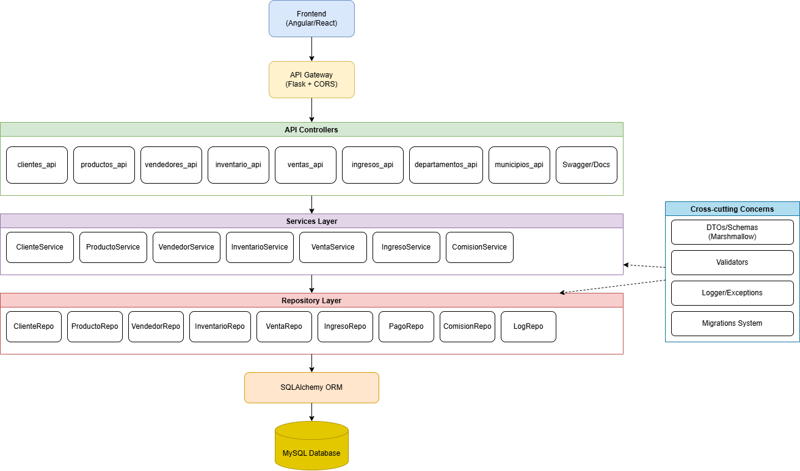

[← Regresar al README](../../../README.md)

# Backlog - Fase 2

### Backlog

## Backlog del Backend - Sistema Imporcomgua

| ID | Épica/Módulo | Historia de Usuario/Tarea | Prioridad | Estado | Puntos | Descripción |
|----|--------------|---------------------------|-----------|---------|---------|-------------|
| **1** | **Infraestructura** | | | | | |
| 1.1 | Base de Datos | Configuración inicial de MySQL | Alta | Completado | 3 | Crear base de datos, esquemas y conexiones |
| 1.2 | Migraciones | Sistema de migraciones | Alta | Completado | 5 | Implementar sistema de migraciones con scripts Python |
| 1.3 | Configuración | Variables de entorno | Alta | Completado | 2 | Configurar .env y gestión de configuraciones |
| 1.4 | CORS | Configuración de CORS | Alta | Completado | 2 | Habilitar CORS para frontend Angular/React |
| 1.5 | Documentación | Integración Swagger/OpenAPI | Media | Completado | 3 | Documentación automática de APIs |
| 1.6 | Logging | Sistema de logs en BD | Media | Completado | 3 | Tabla de logs para auditoría |
| **2** | **Gestión de Clientes** | | | | | |
| 2.1 | CRUD Clientes | Crear cliente con código automático | Alta | Completado | 5 | Generar código cliente basado en departamento |
| 2.2 | CRUD Clientes | Consultar clientes | Alta | Completado | 3 | Listar y buscar por código |
| 2.3 | CRUD Clientes | Actualizar cliente | Alta | Completado | 3 | Actualizar datos del cliente |
| 2.4 | CRUD Clientes | Eliminar cliente | Media | Completado | 2 | Borrado físico de clientes |
| 2.5 | Validaciones | Validar teléfono y NIT | Media | Completado | 3 | Validaciones de formato |
| **3** | **Gestión de Productos** | | | | | |
| 3.1 | CRUD Productos | Crear producto | Alta | Completado | 3 | Crear con unidades de medida |
| 3.2 | CRUD Productos | Consultar productos | Alta | Completado | 3 | Buscar por código/nombre |
| 3.3 | CRUD Productos | Actualizar producto | Alta | Completado | 3 | Modificar datos del producto |
| 3.4 | CRUD Productos | Eliminar producto | Media | Completado | 2 | Borrado de productos |
| 3.5 | Stock | Stock mínimo | Media | Completado | 2 | Definir stock mínimo por producto |
| **4** | **Gestión de Vendedores** | | | | | |
| 4.1 | CRUD Vendedores | Crear vendedor con código auto | Alta | Completado | 3 | Generar código V001, V002, etc |
| 4.2 | CRUD Vendedores | Consultar vendedores | Alta | Completado | 3 | Buscar por nombre/código |
| 4.3 | CRUD Vendedores | Actualizar vendedor | Alta | Completado | 3 | Modificar datos y comisión |
| 4.4 | CRUD Vendedores | Eliminar vendedor | Media | Completado | 2 | Borrado de vendedores |
| 4.5 | Comisiones | Porcentaje de comisión | Alta | Completado | 2 | Definir % comisión por vendedor |
| **5** | **Gestión de Inventario** | | | | | |
| 5.1 | Inventario | Crear registro inventario | Alta | Completado | 3 | Inicializar inventario por producto |
| 5.2 | Inventario | Consultar stock | Alta | Completado | 3 | Ver stock disponible/apartado |
| 5.3 | Movimientos | Registrar movimientos | Alta | Completado | 5 | Ingreso/Salida/Ajuste/Apartado |
| 5.4 | Alertas | Stock bajo mínimo | Media | Completado | 3 | Consultar productos bajo mínimo |
| 5.5 | Trazabilidad | Historial de movimientos | Media | Completado | 3 | Log de todos los movimientos |
| **6** | **Ingresos de Mercancía** | | | | | |
| 6.1 | Ingresos | Crear ingreso con detalles | Alta | Completado | 5 | Ingreso con contenedor/DUCA |
| 6.2 | Ingresos | Consultar ingresos | Alta | Completado | 3 | Buscar por contenedor/DUCA |
| 6.3 | Ingresos | Actualizar ingreso | Media | Completado | 3 | Modificar datos del ingreso |
| 6.4 | Ingresos | Eliminar ingreso | Baja | Completado | 2 | Borrado de ingresos |
| 6.5 | Inventario | Aplicar ingreso a inventario | Alta | Completado | 5 | Actualizar stock automáticamente |
| **7** | **Gestión de Ventas** | | | | | |
| 7.1 | Ventas | Crear venta con detalles | Alta | Completado | 8 | Venta completa con productos |
| 7.2 | Ventas | Consultar ventas | Alta | Completado | 3 | Buscar por envío/cliente/estado |
| 7.3 | Ventas | Anular venta | Alta | Completado | 5 | Anular y liberar inventario |
| 7.4 | Inventario | Apartar stock en venta | Alta | Completado | 5 | Reservar productos vendidos |
| 7.5 | Entregas | Registrar salida de bodega | Alta | Completado | 5 | Confirmar entrega y actualizar stock |
| **8** | **Gestión de Pagos** | | | | | |
| 8.1 | Pagos | Registrar pago de venta | Alta | Completado | 5 | Abonos parciales o totales |
| 8.2 | Pagos | Consultar pagos | Media | Completado | 3 | Historial de pagos por venta |
| 8.3 | Estados | Actualizar estado de cobro | Alta | Completado | 3 | Pendiente/Parcial/Pagada/Morosa |
| 8.4 | Reportes | Ventas pendientes de cobro | Media | Completado | 3 | Listar ventas por cobrar |
| **9** | **Gestión de Comisiones** | | | | | |
| 9.1 | Comisiones | Calcular comisión automática | Alta | Completado | 5 | Calcular al crear venta |
| 9.2 | Comisiones | Consultar comisiones | Media | Completado | 3 | Por vendedor o pendientes |
| 9.3 | Comisiones | Marcar comisión pagada | Media | Completado | 3 | Registrar pago de comisión |
| **10** | **Mejoras Futuras** | | | | | |
| 10.1 | Seguridad | Autenticación JWT | Alta | Pendiente | 8 | Sistema de login y tokens |
| 10.2 | Seguridad | Autorización por roles | Alta | Pendiente | 8 | Permisos por tipo de usuario |
| 10.3 | Reportes | Dashboard de ventas | Media | Pendiente | 5 | Gráficos y estadísticas |
| 10.4 | Reportes | Reporte de inventario | Media | Pendiente | 5 | Estado actual del inventario |
| 10.5 | Notificaciones | Alertas de stock bajo | Media | Pendiente | 5 | Notificar productos bajo mínimo |
| 10.6 | Integraciones | API de facturación DTE | Baja | Pendiente | 8 | Integrar con SAT Guatemala |
| 10.7 | Performance | Caché Redis | Baja | Pendiente | 5 | Mejorar tiempos de respuesta |
| 10.8 | Testing | Pruebas unitarias | Media | Pendiente | 8 | Cobertura de código >80% |
| 10.9 | DevOps | CI/CD Pipeline | Media | Pendiente | 8 | Automatizar despliegues |
| 10.10 | Backup | Sistema de respaldos | Alta | Pendiente | 5 | Backup automático de BD |

### Resumen del Backlog

**Total de historias completadas:** 48  
**Total de historias pendientes:** 10  
**Puntos completados:** 152  
**Puntos pendientes:** 67  
**Puntos totales:** 219  

### Métricas por Módulo

| Módulo | Historias Completadas | Puntos Completados |
|--------|-----------------------|-------------------|
| Infraestructura | 6 | 18 |
| Gestión de Clientes | 5 | 16 |
| Gestión de Productos | 5 | 13 |
| Gestión de Vendedores | 5 | 13 |
| Gestión de Inventario | 5 | 17 |
| Ingresos de Mercancía | 5 | 18 |
| Gestión de Ventas | 5 | 26 |
| Gestión de Pagos | 4 | 14 |
| Gestión de Comisiones | 3 | 11 |
| **Total** | **48** | **152** |

### Definición de Estados

- **Completado:** Funcionalidad implementada y en producción
- **Pendiente:** Funcionalidad planificada pero no iniciada
- **En Progreso:** Funcionalidad en desarrollo (no hay actualmente)