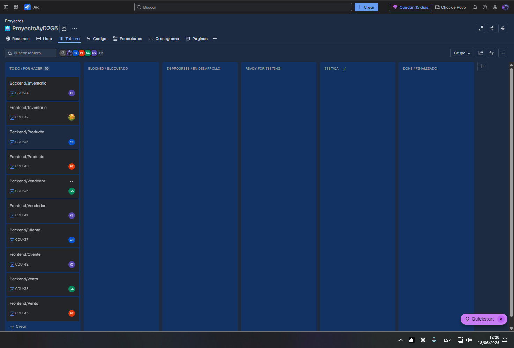

[← Regresar al README](../../../README.md)

## Sprint Planning

### Estado del Sprint Backlog
 
(esto solo es un ejemplo, porque no se bien como lo quieren)
| Tarea | Asignado | Estado |
|-------|----------|---------|
| Backend/Inventario |  Edwin Sandoval | Pendiente |
| Frontend/Inventario | Oscar Morales | Pendiente |
| Backend/Producto |  Carlos Rangel | Pendiente |
| Frontend/Producto |  Pedro Tavico | Pendiente |
| Backend/Vendedor |  Gustavo Girón | Pendiente |
| Frontend/Vendedor | Kevin Secaida | Pendiente |
| Backend/Cliente |  Carlos Rangel | Pendiente |
| Frontend/Cliente | Kevin Secaida | Pendiente |
| Backend/Venta |  Gustavo Giron | Pendiente |
| Frontend/Venta | Pedro Tavico | Pendiente |

### Tablero Inicial
- Tablero Kanban con las tareas del sprint

[← Regresar al README](../../../README.md)
