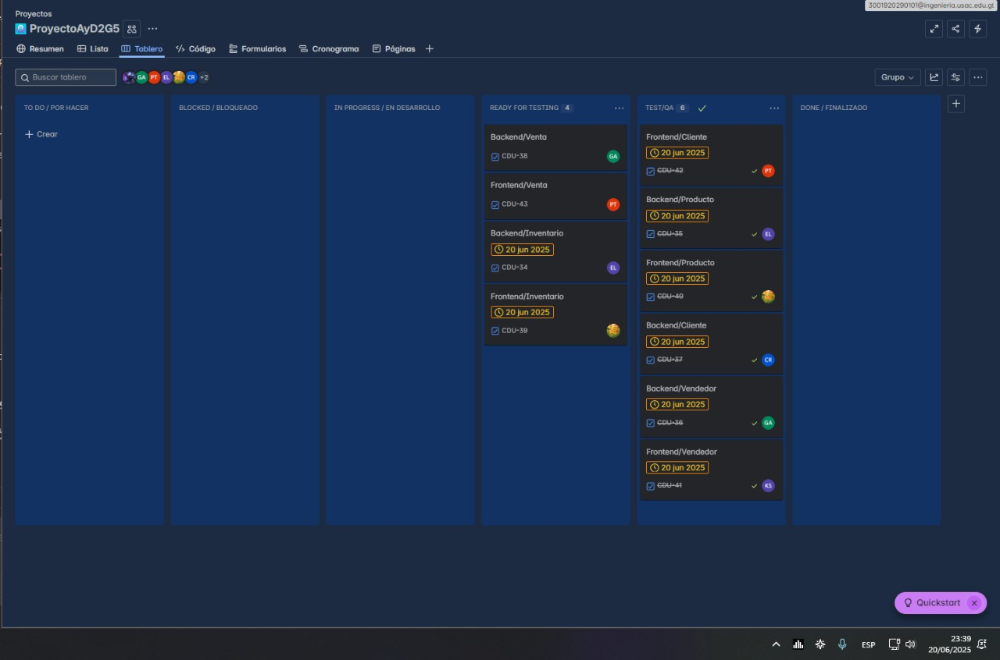

[← Regresar al README](../../../README.md)

# Sprint Retrospective

## Integrante 1: [Nombre del integrante]

### ¿Qué se hizo bien durante el Sprint?
- [Respuesta del integrante]

### ¿Qué se hizo mal durante el Sprint?
- [Respuesta del integrante]

### ¿Qué mejoras se deben implementar para el próximo sprint?
- [Respuesta del integrante]

---

## Integrante 2: [Nombre del integrante]

### ¿Qué se hizo bien durante el Sprint?
- [Respuesta del integrante]

### ¿Qué se hizo mal durante el Sprint?
- [Respuesta del integrante]

### ¿Qué mejoras se deben implementar para el próximo sprint?
- [Respuesta del integrante]

---

## Integrante 3: [Nombre del integrante]

### ¿Qué se hizo bien durante el Sprint?
- [Respuesta del integrante]

### ¿Qué se hizo mal durante el Sprint?
- [Respuesta del integrante]

### ¿Qué mejoras se deben implementar para el próximo sprint?
- [Respuesta del integrante]

---

## Integrante 4: [Nombre del integrante]

### ¿Qué se hizo bien durante el Sprint?
- [Respuesta del integrante]

### ¿Qué se hizo mal durante el Sprint?
- [Respuesta del integrante]

### ¿Qué mejoras se deben implementar para el próximo sprint?
- [Respuesta del integrante]

---

## Integrante 5: [Nombre del integrante]

### ¿Qué se hizo bien durante el Sprint?
- [Respuesta del integrante]

### ¿Qué se hizo mal durante el Sprint?
- [Respuesta del integrante]

### ¿Qué mejoras se deben implementar para el próximo sprint?
- [Respuesta del integrante]

---

## Tablero Final del Sprint

---

## Sprint Backlog - Estado Final

| Elemento del Sprint Backlog | Estado | Justificación |
|------------------------------|--------|---------------|
| [Nombre de la tarea 1] | ✅ Completado | - |
| [Nombre de la tarea 2] | ✅ Completado | - |
| [Nombre de la tarea 3] | ❌ No completado | [Justificación para no completar] |
| [Nombre de la tarea 4] | ✅ Completado | - |
| [Nombre de la tarea 5] | ❌ No completado | [Justificación para no completar] |

[← Regresar al README](../../../README.md)
