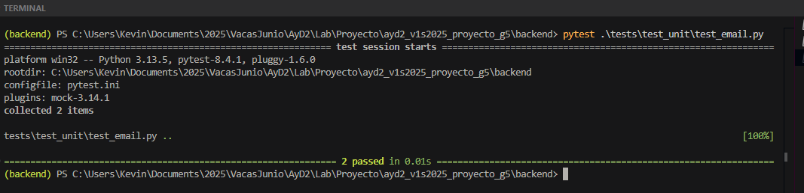
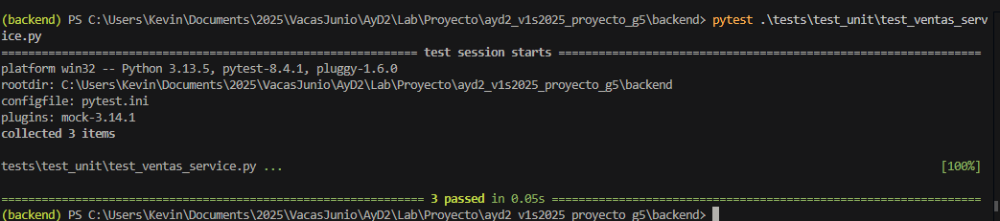

[← Regresar al README](../../../README.md)
# Pruebas Unitarias

Este documento describe las pruebas unitarias implementadas para validar el comportamiento de funciones críticas en el sistema de alertas por correo y en el servicio de ventas.

## `test_mail.py`

### 1 .- `test_construir_cuerpo_alerta`

**Objetivo:**  
Verificar que la función `construir_cuerpo_alerta` genere un cuerpo de mensaje correcto con los datos proporcionados.

**Validaciones:**

- El cuerpo incluye el ID del producto.
- Contiene el stock actual y el mínimo permitido.
- Se muestra el nombre del producto.
- Incluye el título "ALERTA DE STOCK BAJO".

### 2.- `test_crear_mensaje_email`

**Objetivo:**  
Asegurar que `crear_mensaje_email` construya correctamente un mensaje de correo electrónico usando los datos proporcionados.

**Validaciones:**

- El campo `From` coincide con la dirección del remitente.
- El campo `To` incluye los destinatarios como string separado por comas.
- El campo `Subject` contiene el asunto correcto.
- El cuerpo del correo está contenido como objeto `MIMEText` y corresponde al texto especificado.

## `test_ventas_service.py`

### 3.- `test_calcular_comision`

**Objetivo:**  
Verificar que el método interno `_calcular_comision` calcule e inserte correctamente una comisión sobre una venta.

**Contexto simulado:**

- Venta existente con un ID válido.
- Porcentaje de comisión definido.

**Validaciones:**

- Se llama una única vez a `ComisionRepo.create`.
- Los datos enviados incluyen:
  - ID de venta.
  - Porcentaje aplicado (10%).
  - Monto correcto de la comisión (10% de 1000 = 100.0).  
  
### 4.- `test_registrar_pago_monto_valido`

**Objetivo:**  
Validar que el método `registrar_pago` procese correctamente un abono parcial en una venta con saldo pendiente.

**Contexto simulado:**

- Venta con estado `Vigente` y saldo pendiente de 100.
- Se realiza un abono de 50 unidades monetarias.

**Validaciones:**

- El pago se registra sin errores.
- El resultado contiene un objeto con `monto_abono = 50`.

---

### 5.- `test_create_venta_sin_detalles`

**Objetivo:**  
Comprobar que `create_venta` retorna un error si no se incluyen detalles en la solicitud de creación de venta.

**Contexto simulado:**

- Cliente y vendedor válidos.
- Lista de detalles vacía.

**Validaciones:**

- La creación de venta falla.
- Se retorna el mensaje de error: `"Campo requerido: detalles"`.

[← Regresar al README](../../../README.md)