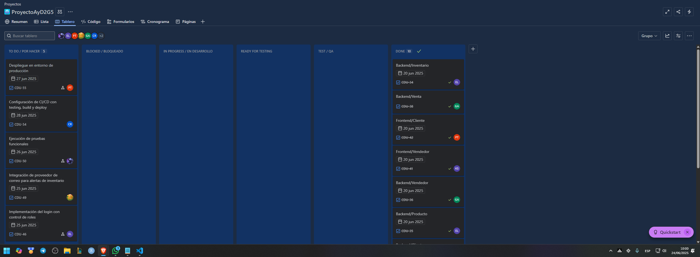
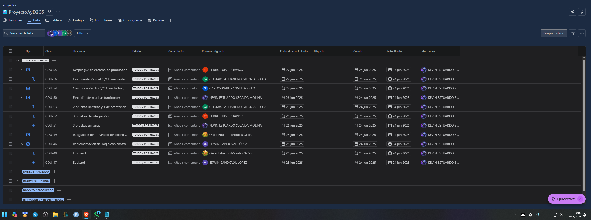

[← Regresar al README](../../../README.md)

## Sprint Planning

### Estado del Sprint Backlog

| Tarea                                                         | Asignado                        | Estado    |
| ------------------------------------------------------------- | ------------------------------- | --------- |
| Despliegue en entorno de producción                           | Carlos Raúl Rangel Robelo       | Pendiente |
| Documentación del CI/CD mediante video                        | Gustavo Alejandro Girón Arriola | Pendiente |
| Configuración de CI/CD con testing, build y deploy            | Carlos Raúl Rangel Robelo       | Pendiente |
| Ejecución de pruebas funcionales                              | Kevin Estuardo Secaida Molina   | Pendiente |
| 2 pruebas unitarias y 1 de aceptación                         | Gustavo Alejandro Girón Arriola | Pendiente |
| 3 pruebas de integración                                      | Pedro Luis Pu Tavico            | Pendiente |
| 3 pruebas unitarias                                           | Kevin Estuardo Secaida Molina   | Pendiente |
| Integración de proveedor de correo para alertas de inventario | Oscar Eduardo Morales Girón     | Pendiente |
| Implementación del login con control de roles                 | Edwin Sandoval López            | Pendiente |
| Frontend (login sub tareas)                                   | Oscar Eduardo Morales Girón     | Pendiente |
| Backend (login sub tareas)                                    | Edwin Sandoval López            | Pendiente |

### Tablero Inicial

- Tablero Kanban con las tareas del sprint

- Lista de tareas del sprint en Jira

---

### Tablero Final
- Tablero Kanban con las tareas del sprint pasadas a test

[← Regresar al README](../../../README.md)
